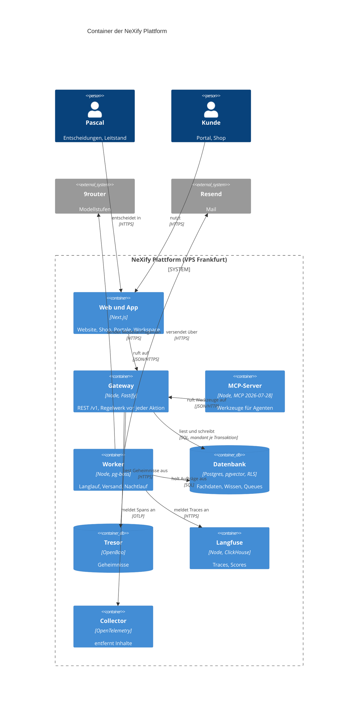

# C4 Ebene 2 · Container

**Stand 28.09.2026 · Zielgruppe:** Technik, Produkt · **Quelle:** deploy/compose.yml, ADR-0001, ADR-0006, ADR-0008

```mermaid
C4Container
  title Container der NeXify Plattform
  Person(pascal, "Pascal", "Entscheidungen, Leitstand")
  Person(kunde, "Kunde", "Portal, Shop")
  System_Boundary(nx, "NeXify Plattform (VPS Frankfurt)") {
    Container(web, "Web und App", "Next.js", "Website, Shop, Portale, Workspace")
    Container(gw, "Gateway", "Node, Fastify", "REST /v1, Regelwerk vor jeder Aktion")
    Container(mcp, "MCP-Server", "Node, MCP 2026-07-28", "Werkzeuge für Agenten")
    Container(wk, "Worker", "Node, pg-boss", "Langlauf, Versand, Nachtlauf")
    ContainerDb(db, "Datenbank", "Postgres, pgvector, RLS", "Fachdaten, Wissen, Queues")
    ContainerDb(bao, "Tresor", "OpenBao", "Geheimnisse")
    Container(lf, "Langfuse", "Node, ClickHouse", "Traces, Scores")
    Container(otel, "Collector", "OpenTelemetry", "entfernt Inhalte")
  }
  System_Ext(router, "9router", "Modellstufen")
  System_Ext(resend, "Resend", "Mail")
  Rel(pascal, web, "entscheidet in", "HTTPS")
  Rel(kunde, web, "nutzt", "HTTPS")
  Rel(web, gw, "ruft auf", "JSON/HTTPS")
  Rel(mcp, gw, "ruft Werkzeuge auf", "JSON/HTTP")
  Rel(gw, db, "liest und schreibt", "SQL, mandant je Transaktion")
  Rel(wk, db, "holt Aufträge aus", "SQL")
  Rel(gw, bao, "liest Geheimnisse aus", "HTTPS")
  Rel(wk, router, "sendet Modellanfragen an", "HTTPS")
  Rel(wk, resend, "versendet über", "HTTPS")
  Rel(gw, otel, "meldet Spans an", "OTLP")
  Rel(wk, lf, "meldet Traces an", "HTTPS")
  UpdateLayoutConfig($c4ShapeInRow="4", $c4BoundaryInRow="1")
```
