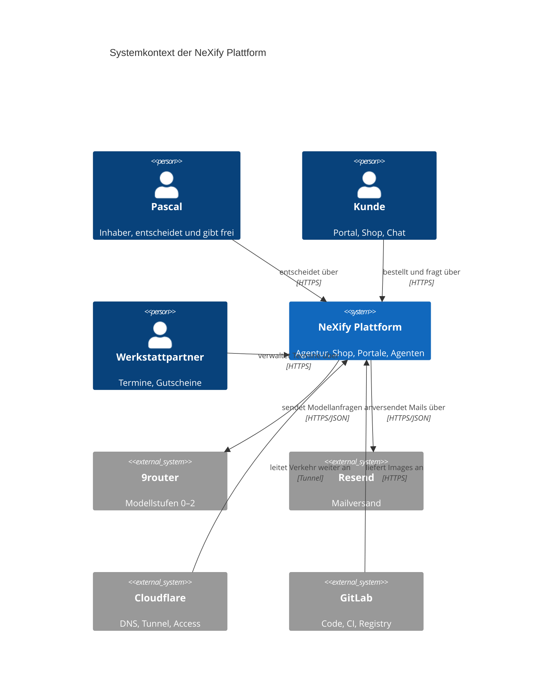

# C4 Ebene 1 · Systemkontext NeXify Plattform

**Stand 28.09.2026 · Zielgruppe:** alle · **Quelle:** ADR-0001, api/openapi.yaml

```mermaid
C4Context
  title Systemkontext der NeXify Plattform
  Person(pascal, "Pascal", "Inhaber, entscheidet und gibt frei")
  Person(kunde, "Kunde", "Portal, Shop, Chat")
  Person(partner, "Werkstattpartner", "Termine, Gutscheine")
  System(nx, "NeXify Plattform", "Agentur, Shop, Portale, Agenten")
  System_Ext(router, "9router", "Modellstufen 0–2")
  System_Ext(resend, "Resend", "Mailversand")
  System_Ext(cf, "Cloudflare", "DNS, Tunnel, Access")
  System_Ext(gitlab, "GitLab", "Code, CI, Registry")
  Rel(pascal, nx, "entscheidet über", "HTTPS")
  Rel(kunde, nx, "bestellt und fragt über", "HTTPS")
  Rel(partner, nx, "verwaltet Termine über", "HTTPS")
  Rel(nx, router, "sendet Modellanfragen an", "HTTPS/JSON")
  Rel(nx, resend, "versendet Mails über", "HTTPS/JSON")
  Rel(cf, nx, "leitet Verkehr weiter an", "Tunnel")
  Rel(gitlab, nx, "liefert Images an", "HTTPS")
```
